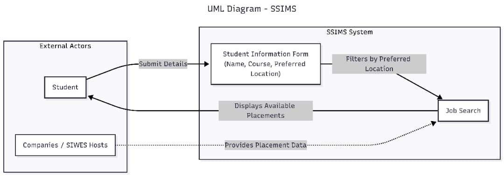

# Software Design Document – SSIMS (Smart SIWES & Internship Management System)

## 1. Software Design Document
This document provides a complete overview of the SSIMS web application.

## 2. Name of those on the software team
- AIGBOKHABHO PEACE ODEGWUA - [ENG2204369] – Frontend + Documentation <br>
- OTUYOMA OROGHENEJERE - [ENG2204044] - Backend <br>
- UKPONG ANDINWAM [ENG2204052] –   <br>
- IYENGUNMWENA EMMANUEL OSARO [ENG2203994] - <br>
- CHARLES JOSHUA [ENG2203968] -<br>
- ONYEKA CLEVER DUMKELECHUKWU [ENG2204035] -<br>
- EHIMARE OSEOJE PRINCE [ENG2102762] -<br>

## 3. Roles of each member
- AIGBOKHABHO PEACE ODEGWUA – Designed and coded the entire frontend (HTML, CSS, Bootstrap), created all pages, implemented the mobile navigation toggle menu, wrote this documentation, and co-managed the GitHub repository.  <br>
- OTUYOMA OROGHENEJERE - [ENG2204044] - <br>
- UKPONG ANDINWAM [ENG2204052] –   <br>
- IYENGUNMWENA EMMANUEL OSARO [ENG2203994] -<br>
- CHARLES JOSHUA [ENG2203968] -<br>
- ONYEKA CLEVER DUMKELECHUKWU [ENG2204035] - <br>
- EHIMARE OSEOJE PRINCE [ENG2102762] - <br>

## 4. Version
- SDD Version: 1.0  
- Software Version: 0.1 (Frontend and Backend)

## 5. UX Requirements
The application is a clean, responsive, mobile-friendly single-page style website.  
- Simple and intuitive navigation (Features, Reviews, About, Login links).  
- Clear form fields with placeholder text.  
- Modern design using background images and icons.  
- Fast loading (all static pages).

## 6.Screenshots
.png)
.png)  
.png)  
.png)  
.png)


## 7.UML  Diagram 



## 8.Class Diagram  
**Entities:**
- Student (firstName, lastName, courseOfStudy, preferredLocation)
- Placement (locationName, companyName, description).  


## 9. Sequence diagram, Context diagram
*Sequence Diagram*  
Student fills form → submits → static placements displayed.  


*Context Diagram*  
Student interacts with SSIMS web app.  


## 10. Implementation
**Programming Languages & Libraries used:**
- *HTML5* – Structure of all pages. Reason: Standard and semantic.  
- *CSS3 + Bootstrap 5* – Styling and responsiveness. Reason: Makes the site mobile-friendly and professional with minimal custom code (cards, forms, icons).  
- *JavaScript (vanilla)* – ONLY for the mobile navigation toggle menu. Reason: Lightweight, no extra framework needed for this simple prototype.  
- Backend: (Node.js + Express.js planned for real API and database).

Development tools: VS Code + Live Server (port 5500).


## 11. Source Code should be well documented
- All major sections have comments. Example from SSIMS.html:

```html
<!-- Mobile Navigation Toggle -->
<button onclick="scrollToLogin" class="button">Get Started</button>

<script>

    var navList = document.getElementById("navLinks");

    function showMenu() {
        navList.style.right = "0";
    }
    function hideMenu() {
        navList.style.right = "-200px";
    }

    function scrollToLogin() {
    document.getElementById("loginForm")
     }
    </script>
```

## 12. README
- See [README](https://github.com/eya0ufe/SSIMS-GROUP-3-CPE461/main/README.md) in the repository root (project title, how to run with Live Server, link to this SDD).


## 13. GitHub (Version Control)
- Repository: [Your GitHub link]
- Used Git with clear commit messages (e.g., “Add images and UML Diagram”, “Create student form page”).
- Frontend fully pushed and viewable.


## 14. Testing, Verification and Validation stage
- Manual testing of all pages on desktop, tablet and mobile.
- Verified mobile menu toggles correctly.
- Form fields validate.
- Tested in Chrome and Edge.


## 15. Test framework and Report
- Framework: Manual testing.
- Test cases passed: <br>
a. Mobile navigation menu opens/closes <br>
b. Form fields required validation <br>
c. All pages responsive on phone <br> 
- Report: Everything works as designed; simple scope kept testing straightforward.


## 17. SOFTWARE DEVELOPMENT PROCESS MODELS
**WATERFALL MODEL**
- This project is the development of the Smart SIWES & Internship Management System (SSIMS). The Waterfall model was selected because the requirements were very clear and the scope was deliberately kept simple.

**Why Waterfall?**
- All features (static pages + one form) were defined from day one.
- Perfect for academic projects needing full documentation.

**Phases Applied**
1. Requirements Analysis
2. System Design
3. Implementation
4. Testing
5. Deployment and Maintenance

   waterfall model diagram

**REQUIREMENT ANALYSIS PHASE** <br>

**Activities:**
- Designed the student form
- listed static pages (Features, Testimonails, About). <br>

**Stakeholders:**
- Students (Main Users) <br>

**Functional Requirements:**
- Displaying Welcoming homepage with “Get Started” button.  
- Show static “Platform Features” page with cards (Student Profile, Company Offers, Progress Tracking, Supervisor Evaluation, Reports & Analytics). 
- Display “What Our Students Say” testimonials.  
- Show “About SSIMS” page with mission and logo.  
- Student Information Form: collect First Name, Last Name, Course of Study, Preferred Location (dropdown), then show available SIWES placements for that location. <br>

**Non Functional Requirements:**
- Responsive design
- fast loading


**IMPLEMENTATION PHASE**
- Built page by page in VS Code.
- Only JavaScript used was the mobile nav toggle.
- Regular Git commits.

**TESTING PHASE**
- Manual testing of every feature (especially mobile menu).
- All bugs fixed immediately.

**DEPLOYMENT PHASE**
- Local deployment via VS Code Live Server.

**Advantages:** Clear milestones and excellent documentation. <br>

**Limitations:** Changes (e.g., adding real database) require going back to earlier phase.

This Waterfall approach ensured the clean, simple frontend was completed perfectly on time.


